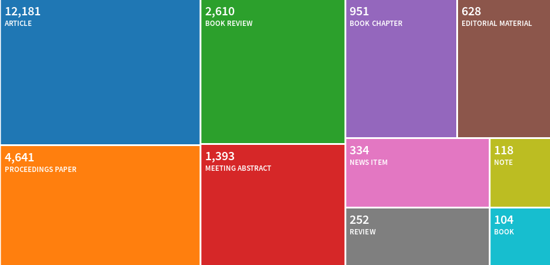
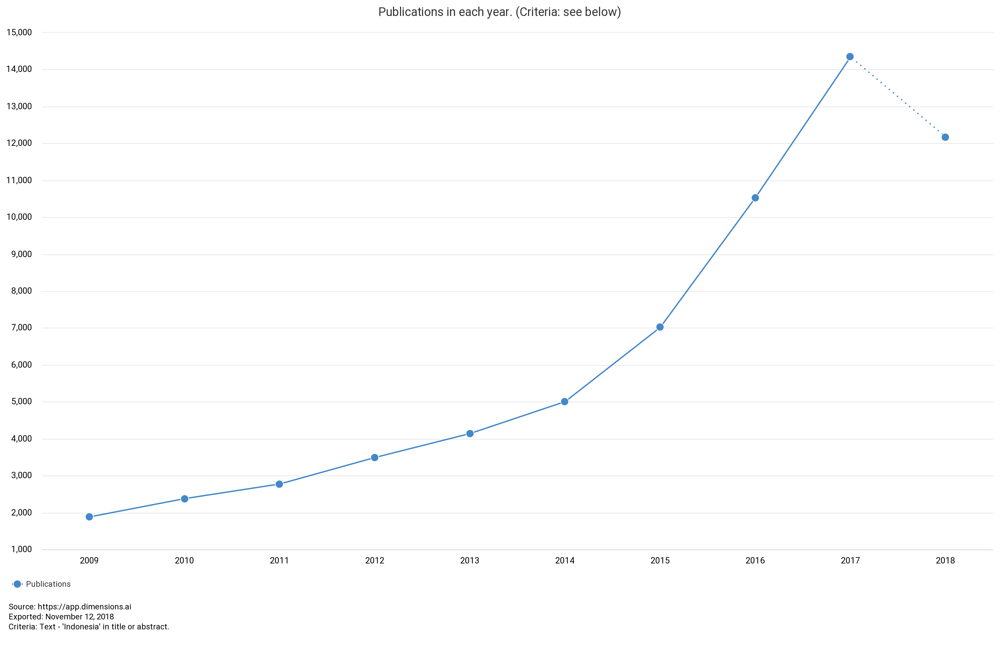
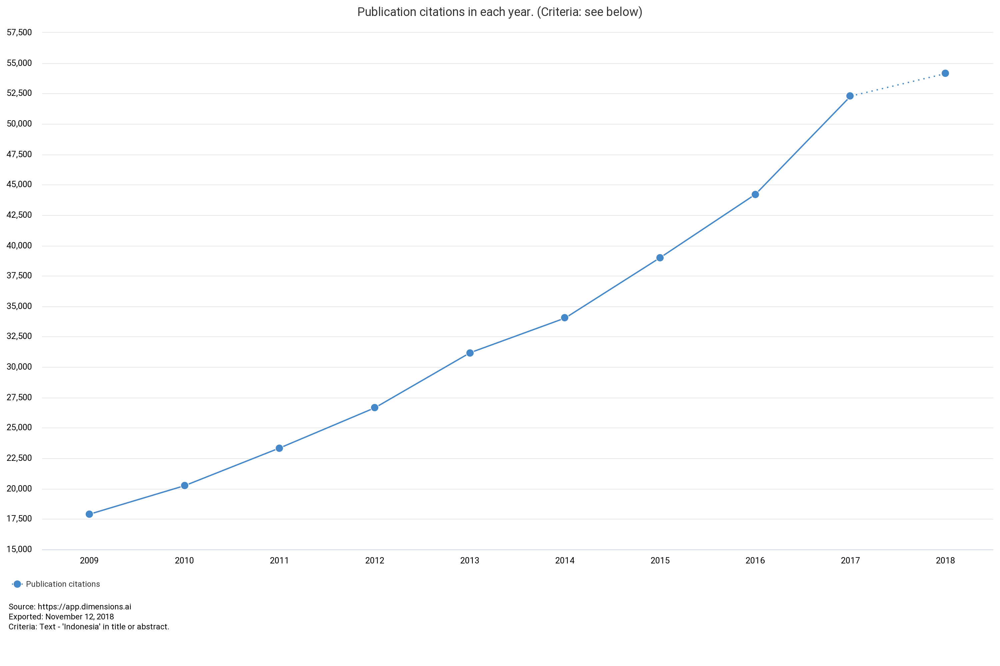
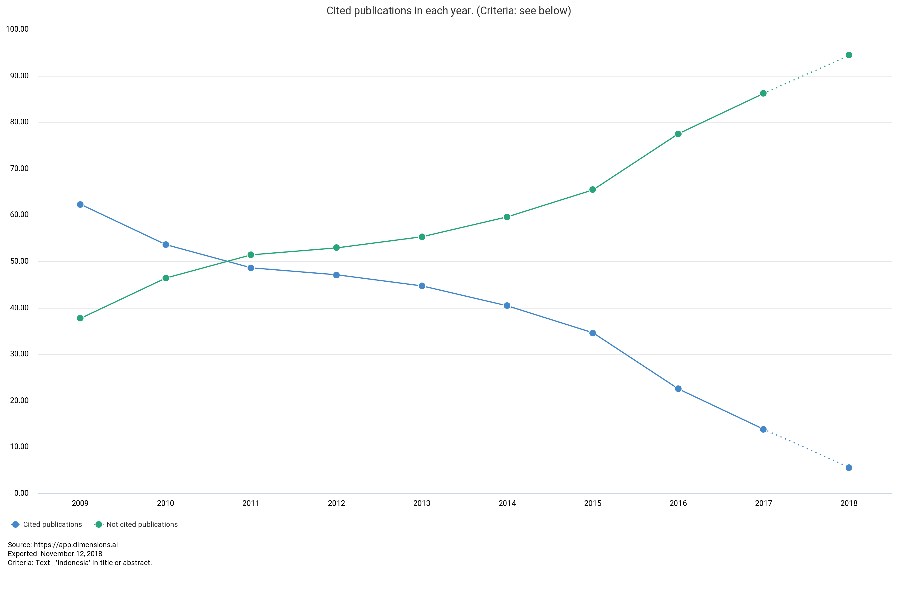
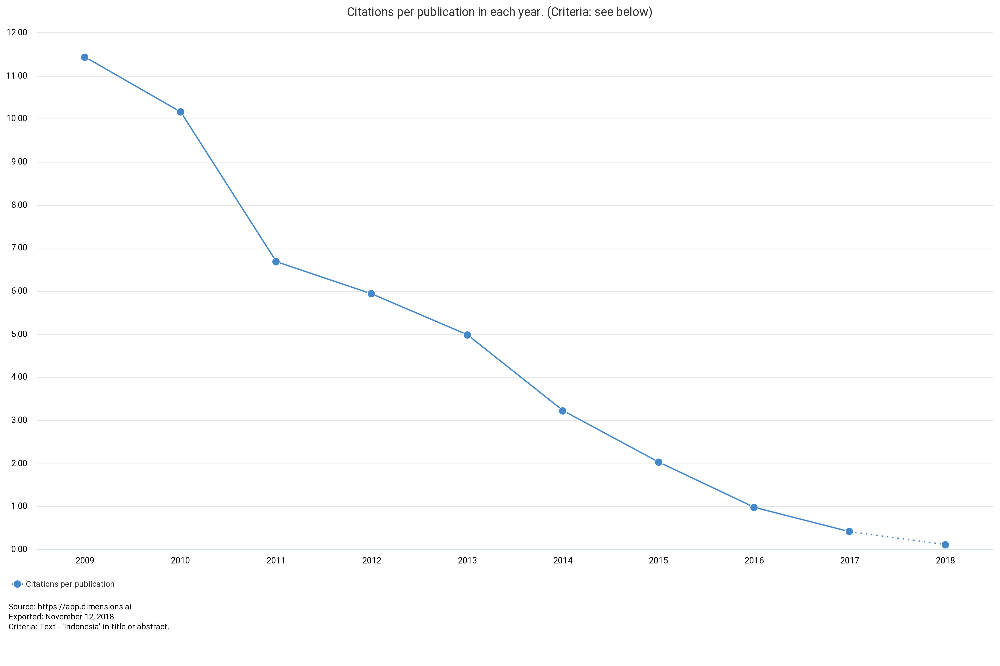
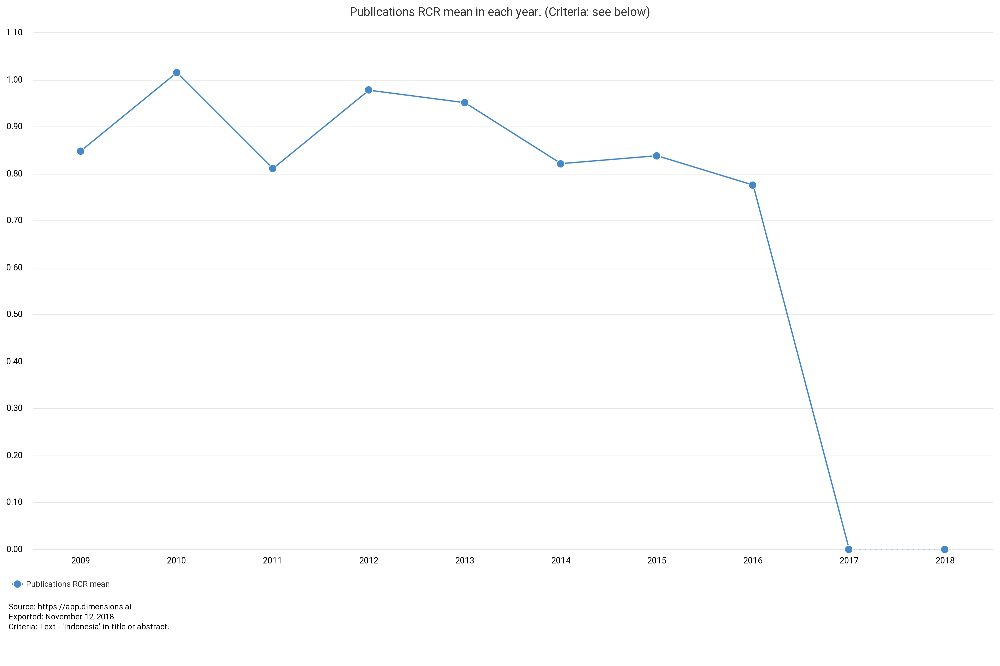
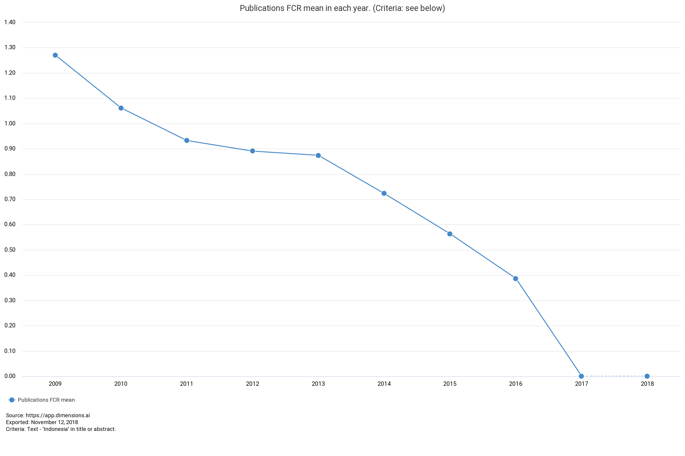

# articles covering Indonesia 

By: 
- Dasapta Erwin Irawan (Institut Teknologi Bandung)
- Dini Sofiani Permatasari
- Lusia Marliana Nurani
- Annisa

## in WOS database

### methods

- access to Web of Science, 09 Nov 2018,
- keywords: `Indonesia`, 
- cascade filtering: `in title`, `open access` only, `article` and `proceeding papers` only 

### results

#### filter stage 1

- filter: `in title`
- results: `22,118` docs, only `4,760` OA
- source data: filter1_intitle_type.txt

#### filter stage 1 (2)

## in Dimensions database

### methods

- access to [Dimensions](https://app.dimensions.ai/discover/publication), 09 Nov 2018,
- keywords: `Indonesia`, 
- cascade filtering: `in title and abstract only`, `open access` only, `article` and `proceeding papers` only 

### results filter stage 1

#### overview

- filter: `in title and abstract`
- results: `88,138` docs,  `36,745` OA
- source data: dim_intitle_type.txt

#### by year

By year

#### sum of citations

#### cited/not cited

#### average citations per publications

### RCR Score

`The Relative Citation Ratio (RCR) is a citation-based measure of scientific influence of a publication. It is calculated as the citations of a paper, normalized to the citations received by NIH-funded publications in the same area of research and year [ref](https://dimensions.freshdesk.com/support/solutions/articles/23000012820-what-is-the-rcr-how-is-the-rcr-score-calculated-).`

#### FCR Score

`The Field Citation Ratio (FCR) is a citation-based measure of scientific influence of one or more articles. It is calculated by dividing the number of citations a paper has received by the average number received by documents published in the same year and in the same Fields of Research (FoR) category. [ref](https://dimensions.freshdesk.com/support/solutions/articles/23000013157-what-is-the-fcr-how-is-it-calculated-)`

