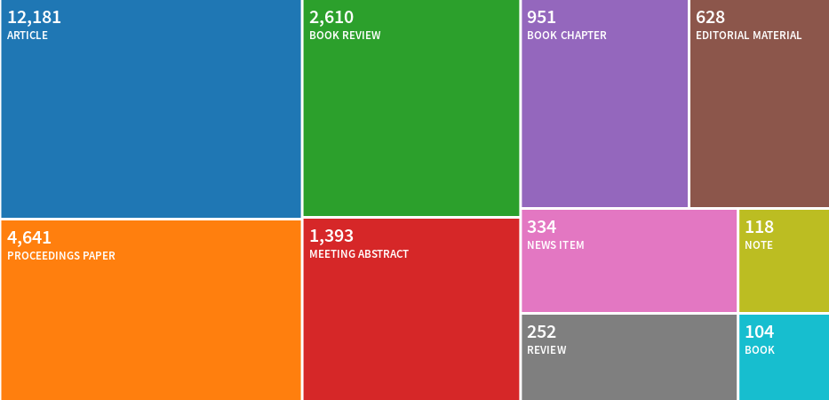
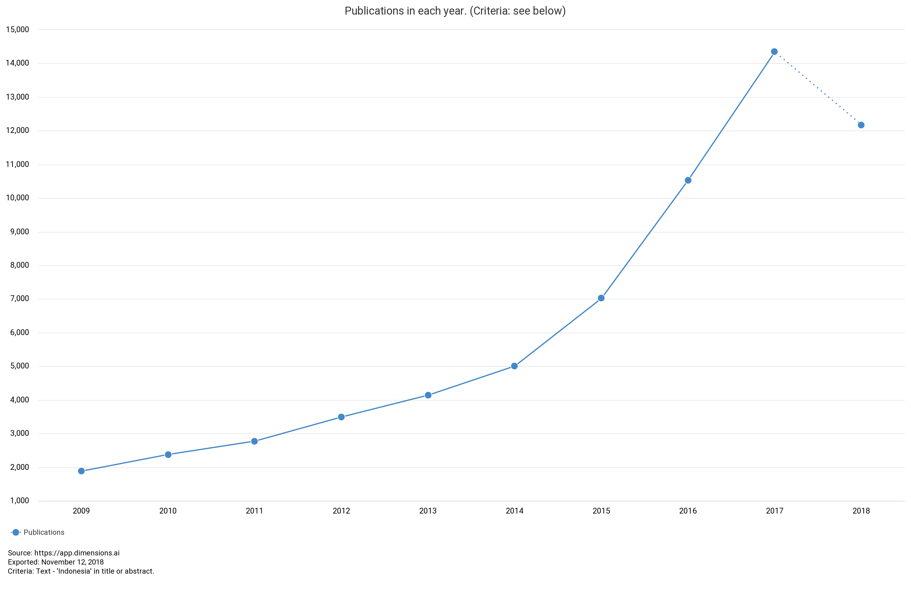
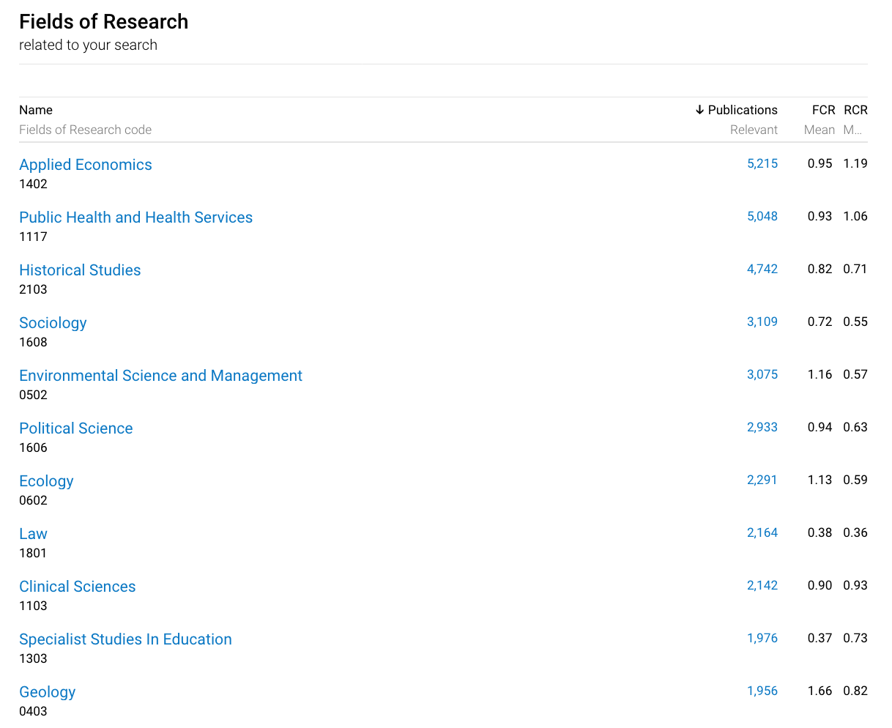
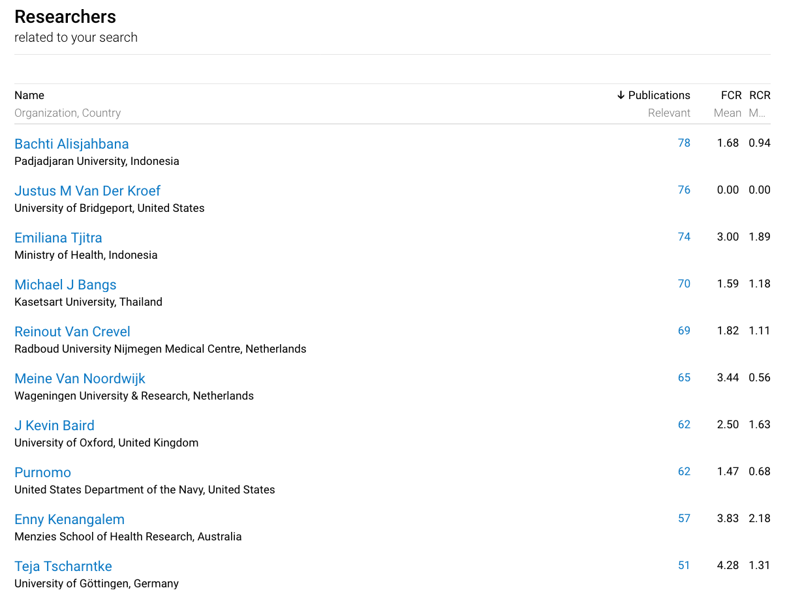
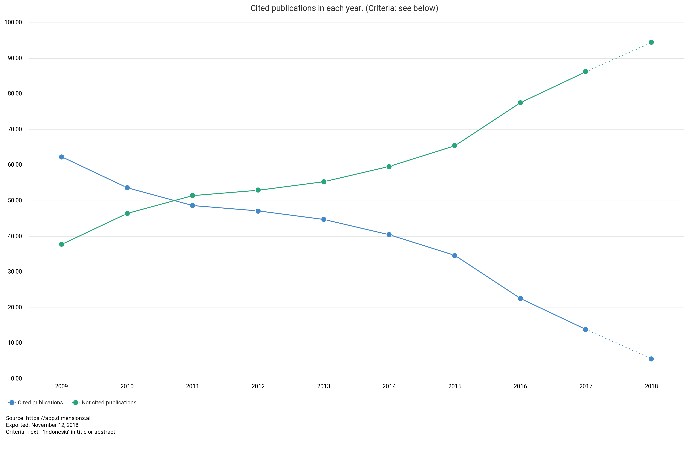
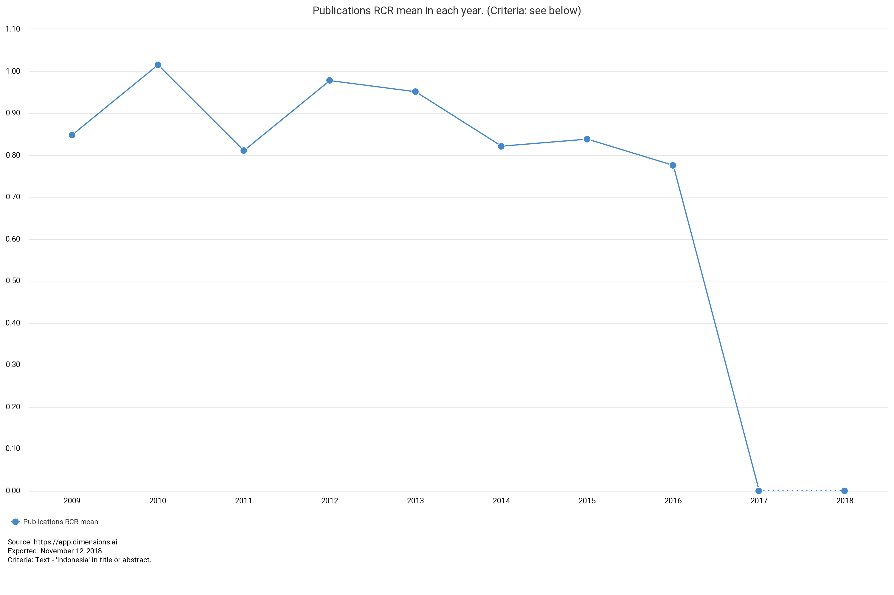
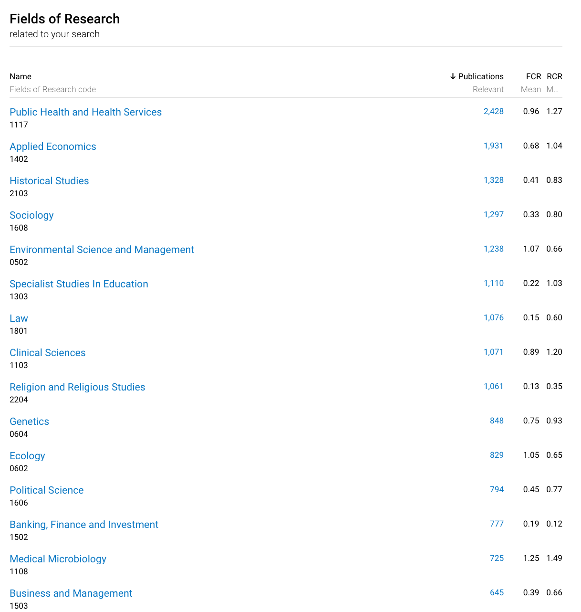
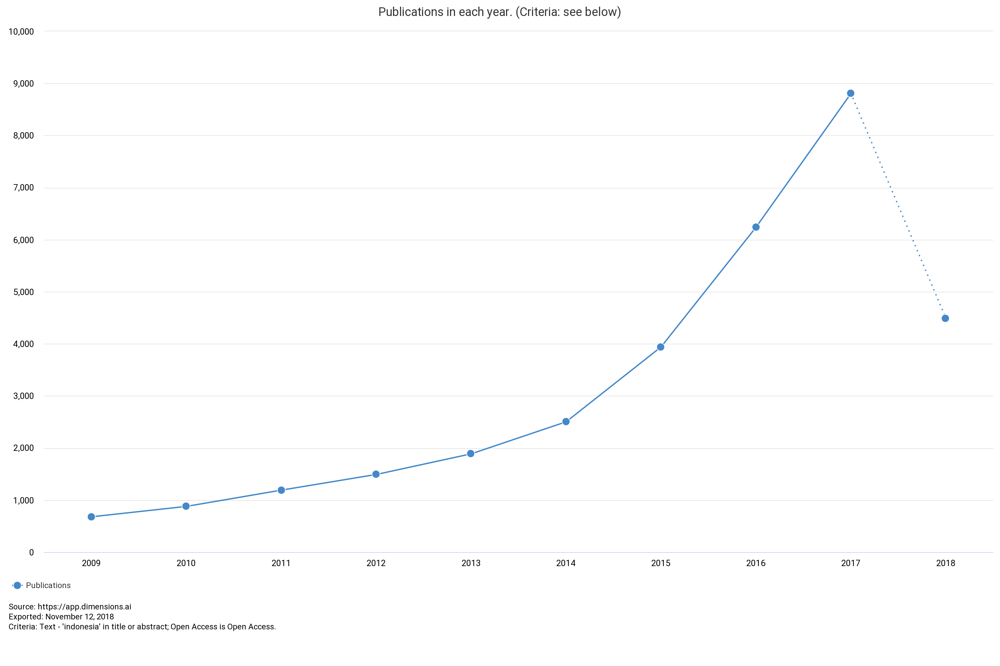
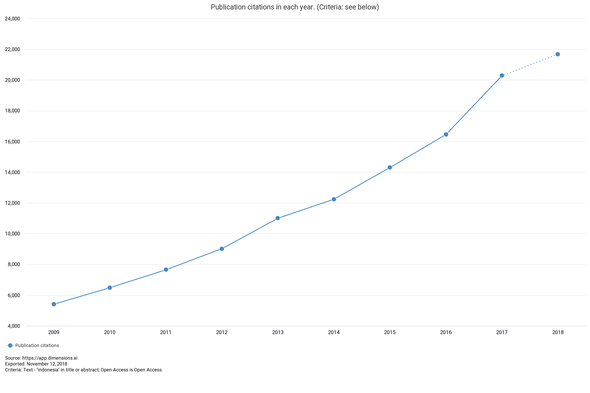
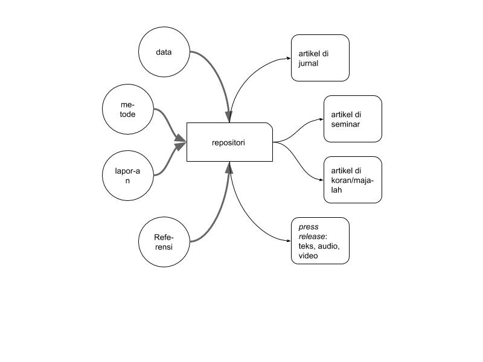

presented
=====

- at Faculty of Engineering, Universitas Sriwijaya
- 13-14 Nov 2018
- [link to slide](https://github.com/dasaptaerwin/pubanalytics/tree/master/article_about_ID) (open the PDF file)
- [link to complete project](https://github.com/dasaptaerwin/pubanalytics)

got any papers?
=====

{width=500px}

let's shift our mindset
=====

`publish (in top journals) or perish`

to

`#terbukaatautertinggal`

meet the (core) team
=====

this work is part of our project funded by Kemristekdikti

- Dasapta Erwin Irawan (Institut Teknologi Bandung) ([ORCID](http://orcid.org/0000-0002-1526-0863))
- Dini Sofiani Permatasari ([GS](https://scholar.google.co.id/citations?user=zAMXg80AAAAJ&hl=en&oi=ao))
- Lusia Marliana Nurani ([GS](https://scholar.google.co.id/citations?user=Dhswtw8AAAAJ&hl=en&oi=ao))
- Aidina Annisa ([IG](https://www.instagram.com/aidinasyauqi/?hl=en))

goals 
=====

to give you a clue of:

1. how big Indonesia is, in terms of science and publication,
2. how it stands internationally,
3. who's been writing articles about Indonesia,
4. how to go OA to maximize your impact?
5. how IR (institutional repository) might help you?

methods
=====

general

- we used Web of Science (WOS) and Dimensions (DIM) databases, 09 Nov 2018,
- WOS is paid database, access provided by ITB
- DIM is a free database

methods (2)
=====

using WOS

- keywords: `Indonesia`, 
- cascade filtering: `in title`, `open access` only, `article` and `proceeding papers` only 

overview
=====

- filter: `in title`
- results: `22,118` docs, only `4,760` OA
- source data: filter1_intitle_type.txt

by type
=====

{width=300px}

Using Dimensions database
=====

methods

- access to [Dimensions](https://app.dimensions.ai/discover/publication), 09 Nov 2018,
- keywords: `Indonesia`, 
- cascade filtering: `in title and abstract only`, `open access` only, `article` and `proceeding papers` only 

overview
=====

- filter: `in title and abstract`
- results: `88,138` docs,  `36,745` OA
- source data: dim_intitle_type.txt

by year
=====

{width=300px}

top 10 field of research
=====

{width=300px}

top 10 authors
=====

{width=300px}

sources
=====

{width=300px}

sum of citations
=====

{width=300px}

cited/not cited
=====

{width=300px}

highest citation
=====

- title: [Estimating Wealth Effects Without Expenditure Data--Or Tears: An Application to Educational Enrollments in States of India](https://app.dimensions.ai/details/publication/pub.1028396354?search_text=indonesia&search_type=kws&search_field=text_search&order=times_cited)
- journal: [Demography](https://link.springer.com/article/10.1353%2Fdem.2001.0003)
- year: 2001
- authors: Deon Filmer (World Bank Group) and Lant H. Pritchett (Harvard University)
- citations: 2.5 K
- JIF 2017: 2.5+

average citations per publications
======

{width=300px}

RCR Score
=====

`The Relative Citation Ratio (RCR) is a citation-based measure of scientific influence of a publication. It is calculated as the citations of a paper, normalized to the citations received by NIH-funded publications in the same area of research and year [ref](https://dimensions.freshdesk.com/support/solutions/articles/23000012820-what-is-the-rcr-how-is-the-rcr-score-calculated-).`

{width=300px}

FCR Score
=====

`The Field Citation Ratio (FCR) is a citation-based measure of scientific influence of one or more articles. It is calculated by dividing the number of citations a paper has received by the average number received by documents published in the same year and in the same Fields of Research (FoR) category. [ref](https://dimensions.freshdesk.com/support/solutions/articles/23000013157-what-is-the-fcr-how-is-it-calculated-)`

{width=300px}

looking at the OA docs
=====

- 36,745 total docs

source 
=====

{width=300px}

researcher 
=====

{width=300px}

field 
=====

{width=300px}

by year
=====

{width=300px}

by year
=====

{width=300px}

sum of citations
=====

{width=300px}

average citation
=====

{width=300px}

highest citation{width=300px}
=====

- title: [Variations in Tropical Sea Surface Temperature and Surface Wind Fields Associated with the Southern Oscillation/El Niño](https://app.dimensions.ai/details/publication/pub.1004826383?search_text=indonesia&search_type=kws&search_field=text_search&order=times_cited&or_facet_open_access=True)
- journal: [Monthly Weather Review](https://journals.ametsoc.org/doi/abs/10.1175/1520-0493%281982%29110%3C0354%3AVITSST%3E2.0.CO%3B2)
- year: 1982
- authors: Eugene M. Rasmusson and Thomas H. Carpenter
- citations: 1.6 K
- JIF 2017: 3.2+

what about another country: eg Nigeria, Japan, Thailand, Malaysia
=====

- why don't we have a go

what about another country: eg USA, UK, Canada, etc
=====

- why don't we have a go.

remarks
=====

- upstream vs downstream (closer to user)
- OA means more readers (sometimes led to more citations)
- how to go OA?

remarks (2)
=====

- there are more papers about Indonesia: ID vs EN language papers
- local topic vs international interests
- there are more ways to disseminate your results than only put it as papers

how to go OA? 
=====

- publish in APC-based journals or `gold OA journals` (if you have the money)
- what if you have less or no funding:
  
    - publish in no-APC journals or `diamond OA journals`
    - publish in non-OA/paywalled journals but the preprint/`pre-peer reviewed version` (or accepted version) to your institutional repository (IR) or open-free repository (eg: INArxiv) but pls **check the journal's self-archiving policy** -- `green OA`

OR
=====

you could just post your whole research files to IR and cite it in your papers ([ref](https://osf.io/srznb/)).

{width=300px}

discussions 
=====

I invite questions, comments, feedback.

you can send me emails to: `dasaptaerwin3` at gmail

or mention me on Twitter: [@dasaptaerwin](https://twitter.com/dasaptaerwin)