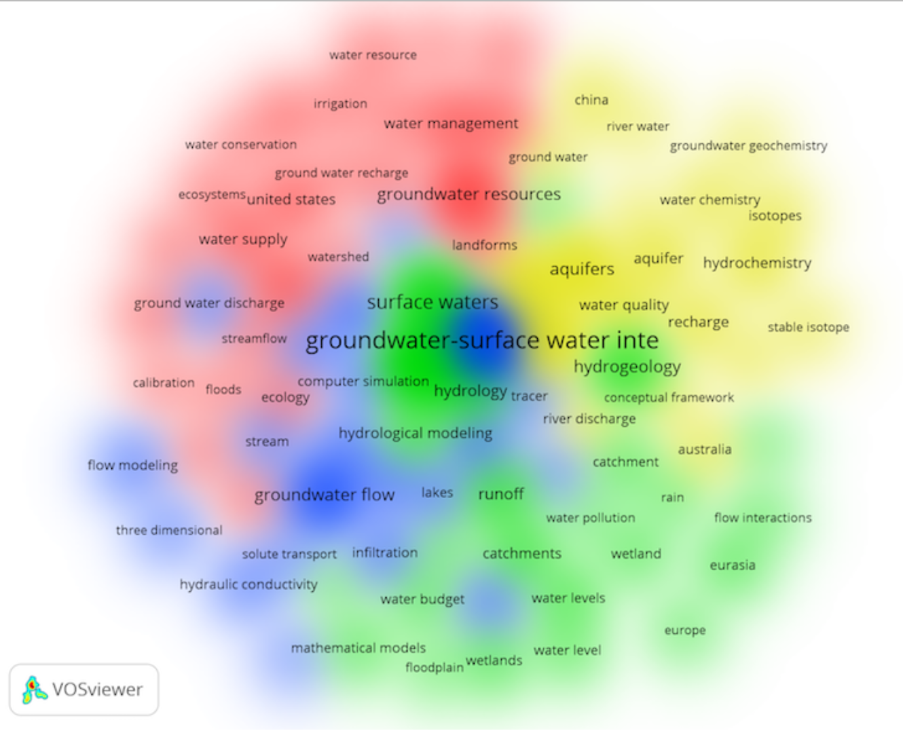
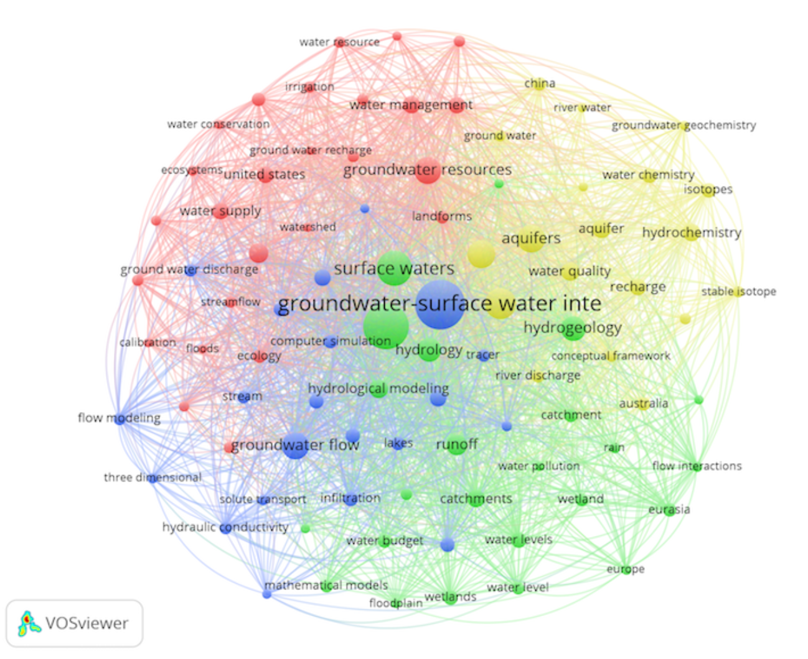
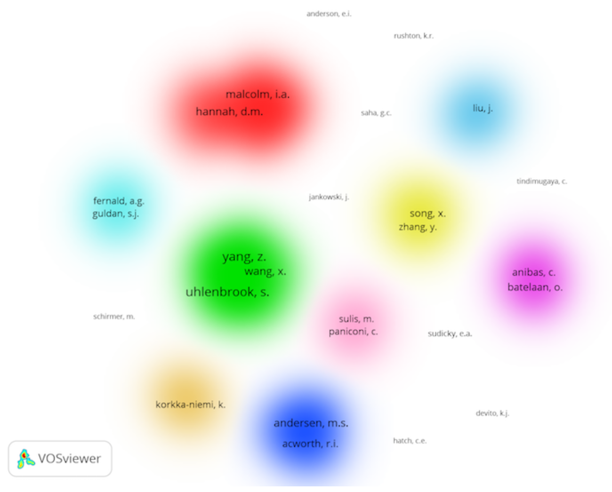

presented
=====

- at Faculty of Engineering, Universitas Sriwijaya
- 13-14 Nov 2018
- [link to slide](https://github.com/dasaptaerwin/pubanalytics/tree/master/article_about_ID) (open the PDF file)
- [link to full papers](https://osf.io/preprints/inarxiv/he9sa/)

got any papers?
=====

{width=500px}

let's shift our mindset
=====

`publish (in top journals) or perish`

to

`#terbukaatautertinggal`

meet the (core) team
=====

this work is part of our project funded by Kemristekdikti in 2017 and 2018

- Dasapta Erwin Irawan (Institut Teknologi Bandung) ([ORCID](http://orcid.org/0000-0002-1526-0863))
- Deny Juanda Puradimaja ([GS]()), 
- Ahmad Darul ([GS]()),
- Budi Brahmantyo (alm) ([GS]()),
- and a bunch of undergrad and master students

goals 
=====

to give you a clue of:

1. what happens in the hydrological literature?
2. can we classify all those papers?
3. who wrote them?
4. are they connected?
5. what can we learn from them? 

methods
=====

a complete and detail instruction is provided in the [full paper](https://osf.io/preprints/inarxiv/he9sa/).

- we used Scopus database, 30 Dec 2017,
- scopus is paid database, access provided by ITB
- [vosviewer](vosviewer.com), a free visualization tool made by CWTS Leiden

methods (2)
=====

using scopus

- keywords: `surface water` AND `groundwater` AND `interactions` 
- filter: `in title`
- download the search results, in `RIS` format or you could always download a portable format like `csv` or `bibtex` then load it to `zotero` ref manager. you could exporte the library to `RIS` later on. 

clusters of keywords (1)
=====

{width=300px}

clusters of keywords (2)
=====

{width=300px}

clusters of authorship (1)
=====

{width=300px}

clusters of authorship (2)
=====

{width=300px}

remarks
=====

- Many authors have contributed their knowledge to this subject and rapid growth started in early 2000’s.

remarks
=====

- Closely connected keywords but less collaboration (cross-country collabo- ration) among scientist in this field.

remarks
=====

- There are weak (or underrepresented) papers to connect ”water resource management” with other keywords.

remarks
=====

- There are several preliminary-identified gaps in this corpus: geophysical method, tropical region, more water-related geohazards (like land subsi- dence and landslide), more systemic study based on local geological set- ting, such as: volcanic hydrogeological system, groundwater system in coastal area).

remarks
=====

- Each gap is an opportunity for Indonesian authors to explore the original- ity of Indonesia that have been deeply covered by our own ignorance.

discussions 
=====

I invite questions, comments, feedback.

you can send me emails to: `dasaptaerwin3` at gmail

or mention me on Twitter: [@dasaptaerwin](https://twitter.com/dasaptaerwin)